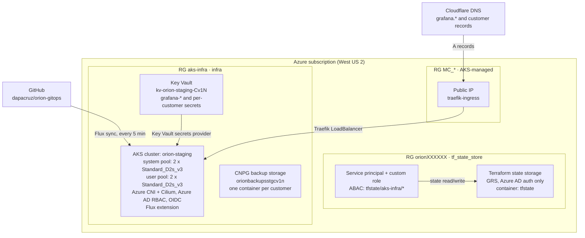
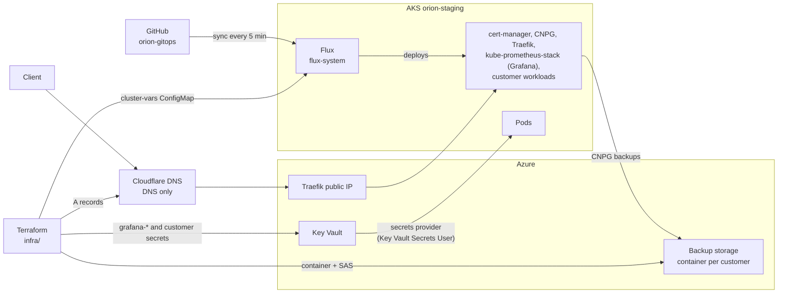
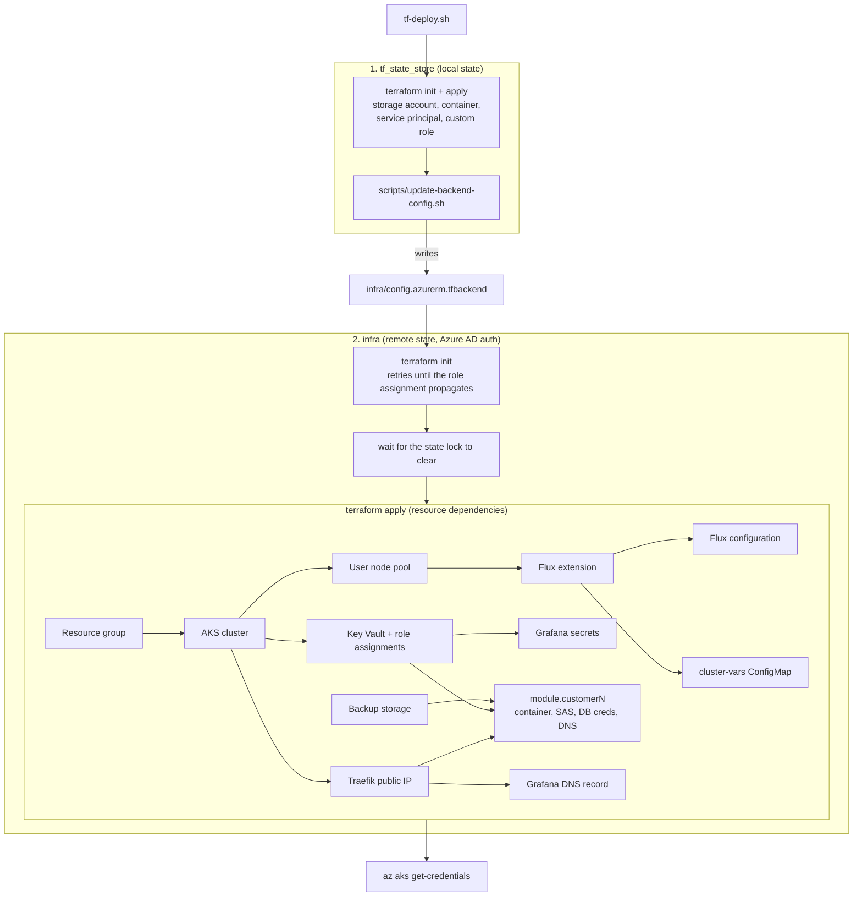

# AKS Infrastructure

Terraform for an Azure Kubernetes Service (AKS) staging cluster (`orion-staging`) with Flux GitOps, Azure Key Vault secrets, Cloudflare DNS and per-customer backup storage.

## Table of Contents

- [Overview](#overview)
- [Architecture](#architecture)
- [Prerequisites](#prerequisites)
- [Repository Structure](#repository-structure)
- [Getting Started](#getting-started)
- [Deployment](#deployment)
- [Infrastructure Components](#infrastructure-components)
- [Terraform State Backend](#terraform-state-backend)
- [Multi-Tenant Customer Module](#multi-tenant-customer-module)
- [GitOps Integration](#gitops-integration)
- [Security](#security)
- [Monitoring](#monitoring)
- [Backup and Recovery](#backup-and-recovery)
- [Configuration](#configuration)
- [Maintenance](#maintenance)
- [Troubleshooting](#troubleshooting)

## Overview

This repository has two independent Terraform root modules:

| Directory | Purpose | State |
|-----------|---------|-------|
| `tf_state_store/` | Storage account, service principal and custom role used as the remote backend for `infra/` | Local |
| `infra/` | AKS cluster, Key Vault, backup storage, Flux, Cloudflare DNS and customer modules | Remote (Azure Storage) |

What `infra/` provisions:

- **AKS cluster** `orion-staging` in West US 2 (Cilium data plane and network policy, Azure AD RBAC, OIDC issuer)
- **Flux** via the AKS `microsoft.flux` extension, syncing [dapacruz/orion-gitops](https://github.com/dapacruz/orion-gitops)
- **Key Vault** (RBAC-authorized) holding Grafana and per-customer secrets, surfaced to the cluster through the Key Vault secrets provider
- **CNPG backup storage** with one blob container, SAS token and set of credentials per customer
- **Static public IP** for the Traefik ingress and **Cloudflare** A records pointing at it

Grafana, Traefik and the CNPG clusters themselves are deployed by Flux from the GitOps repository, not by this repository.

## Architecture

### Resource Layout

Each resource group is labelled with the Terraform root module that manages it. `MC_*` is the resource group AKS creates for the cluster's nodes and load balancer.



### Runtime Flows

Flux deploys the workloads (cert-manager, CNPG, Traefik, kube-prometheus-stack and the customer apps) from the GitOps repository. Terraform supplies the secrets, backup storage and cluster variables they depend on.



## Prerequisites

### Required Tools

- [Terraform](https://www.terraform.io/downloads.html) `~> 1.14`
- [Azure CLI](https://docs.microsoft.com/en-us/cli/azure/install-azure-cli)
- [kubectl](https://kubernetes.io/docs/tasks/tools/)
- [kubelogin](https://github.com/Azure/kubelogin), required by the Terraform `kubernetes` provider as well as `kubectl`
- [Flux CLI](https://fluxcd.io/flux/installation/) (optional, for troubleshooting)
- Bash and Perl (macOS/Linux or WSL). The deploy scripts and the backend-config helper use both.

### Azure Requirements

- Azure subscription where you can create resource groups, role definitions and role assignments (Owner, or Contributor plus User Access Administrator)
- Azure AD permissions to create applications, service principals and secrets (used by `tf_state_store`)
- An Azure AD group for AKS administrators. Its object ID is currently hardcoded in `infra/aks.tf` and `tf_state_store/storage.tf`, so change it there to use your own group.

### External Services

- **Cloudflare**: a zone for your domain and an API token with DNS edit permission
- **GitHub**: the GitOps repository configured in `infra/flux.tf`
- **Telegram bot** (optional): its token and chat ID are stored in Key Vault for Grafana alerting

## Repository Structure

```
aks-infra/
├── tf_state_store/                  # Terraform remote state backend
│   ├── scripts/
│   │   └── update-backend-config.sh # Writes ../infra/config.azurerm.tfbackend
│   ├── main.tf                      # Providers
│   ├── storage.tf                   # Storage account, container, SP, custom role
│   ├── infra-backend.tf             # Runs update-backend-config.sh after apply
│   ├── variables.tf
│   ├── outputs.tf
│   ├── condition.tpl                # ABAC condition scoping the SP to aks-infra/*
│   └── secrets.auto.tfvars.example
│
├── infra/                           # Main AKS infrastructure
│   ├── modules/
│   │   └── customer/                # Per-customer module
│   │       ├── main.tf
│   │       ├── variables.tf
│   │       └── outputs.tf
│   ├── main.tf                      # Providers and azurerm backend
│   ├── aks.tf                       # Resource group, cluster, node pools, Traefik IP
│   ├── key-vault.tf                 # Key Vault, role assignments, Grafana secrets
│   ├── backups.tf                   # CNPG backup storage account
│   ├── flux.tf                      # Flux extension, configuration, cluster-vars
│   ├── cloudflare.tf                # Grafana DNS record
│   ├── customers.tf                 # Customer module instances
│   ├── variables.tf
│   ├── outputs.tf
│   ├── tf-init.sh                   # terraform init with the backend config
│   ├── config.azurerm.tfbackend.example
│   └── secrets.auto.tfvars.example
│
├── tf-deploy.sh                     # Full deployment
├── tf-undeploy.sh                   # Full teardown
└── README.md
```

## Getting Started

### 1. Clone the Repository

```bash
git clone <repository-url>
cd aks-infra
```

### 2. Create Local Config Files

Copy the example files. The real files are git-ignored (`*.tfvars`, `*.tfbackend`).

```bash
cp tf_state_store/secrets.auto.tfvars.example tf_state_store/secrets.auto.tfvars
cp infra/secrets.auto.tfvars.example          infra/secrets.auto.tfvars
cp infra/config.azurerm.tfbackend.example     infra/config.azurerm.tfbackend
```

**tf_state_store/secrets.auto.tfvars:**
```hcl
ARM_SUBSCRIPTION_ID = "your-subscription-id"
```

**infra/secrets.auto.tfvars:**
```hcl
ARM_SUBSCRIPTION_ID        = "your-subscription-id"
CLOUDFLARE_API_TOKEN       = "your-cloudflare-api-token"
CLOUDFLARE_ZONE_ID         = "your-cloudflare-zone-id"
GRAFANA_USER               = "admin"
GRAFANA_PASSWORD           = "your-secure-password"
GRAFANA_TELEGRAM_BOT_TOKEN = "your-telegram-bot-token"
GRAFANA_TELEGRAM_CHAT_ID   = "your-telegram-chat-id"
```

`infra/config.azurerm.tfbackend` does not need editing. `tf_state_store` fills it in when it is applied (see [Terraform State Backend](#terraform-state-backend)), and the file must already exist for that to work.

### 3. Authenticate with Azure

```bash
az login
az account set --subscription "your-subscription-id"
```

## Deployment

### Automated Deployment

```bash
./tf-deploy.sh
```

The script runs with `set -e` and **`terraform apply -auto-approve`**, so it will not prompt before creating resources. It:

1. Runs `terraform init` and `apply` in `tf_state_store/`, which also updates `infra/config.azurerm.tfbackend`
2. Reads the storage account and container names from the outputs
3. Runs `terraform init -backend-config=./config.azurerm.tfbackend` in `infra/`, retrying every 10 seconds until it succeeds (the new role assignment can take time to propagate)
4. Waits until the state blob has no lock
5. Runs `terraform apply` in `infra/`
6. Runs `az aks get-credentials` for the new cluster



### Manual Deployment

#### Step 1: Deploy the State Backend

```bash
cd tf_state_store
terraform init
terraform apply
```

#### Step 2: Initialize the Main Infrastructure

```bash
cd ../infra
./tf-init.sh
```

#### Step 3: Deploy the Main Infrastructure

```bash
terraform plan
terraform apply
```

#### Step 4: Configure kubectl

```bash
az aks get-credentials \
  --resource-group aks-infra \
  --name orion-staging \
  --overwrite-existing
```

### Verify Deployment

```bash
kubectl get nodes
kubectl get pods -n flux-system
kubectl get configmap cluster-vars -n flux-system -o yaml
```

## Infrastructure Components

### AKS Cluster (`infra/aks.tf`)

- **Name**: `orion-staging` (DNS prefix `staging`), resource group `aks-infra`, West US 2
- **Identity**: system-assigned managed identity
- **Kubernetes version**: not pinned, so the AKS default applies; `automatic_upgrade_channel = "patch"`
- **OIDC issuer**: enabled

**Node pools** (both `Standard_D2s_v3`, fixed 2 nodes, no autoscaling, `max_surge` 33%):
- **System pool** (`agentpool`): `only_critical_addons_enabled`, so only critical add-ons schedule here
- **User pool** (`userpool`): application workloads

**Networking:**
- Network plugin: `azure`
- Network policy and data plane: `cilium`

**Authentication:**
- Azure AD integration with Azure RBAC enabled
- Admin group (object ID in `aks.tf`) is also assigned *Azure Kubernetes Service Cluster Admin Role* on the cluster

**Add-ons:**
- Key Vault secrets provider (`secret_rotation_enabled = false`)

**Maintenance windows** (auto-upgrade and node OS): weekly, Sunday 02:00 UTC, 4 hours. Node OS channel is `NodeImage`.

### Azure Key Vault (`infra/key-vault.tf`)

- **Name**: `kv-orion-staging-Cv1N`, `standard` SKU, RBAC authorization
- **Soft delete**: 7 days. **Purge protection**: disabled.
- **Role assignments**:
  - The identity running Terraform: *Key Vault Administrator*
  - The AKS Key Vault secrets provider identity: *Key Vault Secrets User*

**Secrets managed by Terraform:**

| Secret | Source |
|--------|--------|
| `grafana-admin-user` | `GRAFANA_USER` |
| `grafana-admin-password` | `GRAFANA_PASSWORD` |
| `grafana-telegram-bot-token` | `GRAFANA_TELEGRAM_BOT_TOKEN` (value changes ignored after creation) |
| `grafana-telegram-chat-id` | `GRAFANA_TELEGRAM_CHAT_ID` (value changes ignored after creation) |
| `storage-account-name` | Shared CNPG backup storage account name |
| `<customer>-db-user`, `<customer>-db-password`, `<customer>-blob-sas` | Customer module |

### Backup Storage Account (`infra/backups.tf`)

- **Name**: `orionbackupsstgcv1n`
- **Tier / replication**: Standard / LRS
- **Minimum TLS**: 1.2
- **Blob versioning**: enabled
- No delete-retention or change-feed settings are configured.

### Traefik Public IP (`infra/aks.tf`)

- **Name**: `traefik-ingress`, Standard SKU, static
- Created in the cluster's node resource group so the Traefik load balancer service can use it
- A destroy-time `local-exec` runs `kubectl delete service -n traefik traefik-traefik --ignore-not-found` so the IP is released cleanly (requires `kubectl` access to the cluster)

### Cloudflare DNS (`infra/cloudflare.tf`)

- `grafana.orion-staging.dcinfrastructures.io` → Traefik IP (A record, DNS only)
- Customer records are created by the customer module.

## Terraform State Backend

`tf_state_store/` creates:

- A resource group and storage account named `orion<6 random chars>` (GRS, TLS 1.2, shared key access disabled, Azure AD auth only)
- A private `tfstate` container with versioning, a 90-day change feed and 30-day blob and container delete retention
- An Azure AD application, service principal and password for Terraform to use as backend credentials
- A custom role granting blob read/write plus user-delegation-key access, assigned to that service principal with an ABAC condition (`condition.tpl`) that limits writes to the `tfstate` container and blobs under `aks-infra/`
- *Storage Blob Data Contributor* for the admin group
- A `null_resource` that runs `scripts/update-backend-config.sh` to write the storage account, container, tenant, subscription and service principal credentials into `infra/config.azurerm.tfbackend`

The `infra/` backend uses `key = "aks-infra/terraform.tfstate"` and `use_azuread_auth = true`.

> **Note:** `tf_state_store` itself uses local state (`terraform.tfstate` in that directory, git-ignored). Losing it means losing track of the backend resources. The service principal secret is also written in plain text to the git-ignored backend config file and exposed as the `client_secret` output.

## Multi-Tenant Customer Module

`infra/modules/customer/` provisions the per-customer resources needed by a CNPG cluster deployed through GitOps.

### Module Resources

1. **Storage container**: private container named after the customer in the shared backup account
2. **SAS token**: container-scoped, HTTPS only, with read/write/delete/list/add/create permissions
3. **Database password**: 24-character alphanumeric `random_password` (`ignore_changes = all`, so it is generated once)
4. **Key Vault secrets**: `<customer>-blob-sas`, `<customer>-db-user`, `<customer>-db-password`
5. **DNS records**: Cloudflare A records pointing at the Traefik IP, one per `dns_records` entry

### Module Inputs

| Variable | Type | Description | Default |
|----------|------|-------------|---------|
| `customer_name` | string | Customer identifier, used in the container and secret names | Required |
| `db_user` | string | Database username stored in Key Vault | `"app"` |
| `storage_account_id` | string | Shared backup storage account ID | Required |
| `storage_account_primary_connection_string` | string (sensitive) | Connection string used to generate the SAS token | Required |
| `key_vault_id` | string | Key Vault ID | Required |
| `kv_admin_role_assignment_id` | string | Role assignment ID, used only for `depends_on` ordering | Required |
| `cloudflare_zone_id` | string | Cloudflare zone ID | Required |
| `traefik_ip_address` | string | Traefik ingress IP | Required |
| `dns_records` | map(object({name, proxied})) | DNS records to create | `{}` |
| `sas_validity_hours` | number | SAS validity from the time of apply | `17520` (2 years) |

### Module Outputs

`storage_container_name`, `sas_token` (sensitive), `db_password` (sensitive), `dns_record_names`.

### Adding a New Customer

Add a module block to `infra/customers.tf`:

```hcl
module "customer2" {
  source = "./modules/customer"

  customer_name                             = "customer2"
  storage_account_id                        = azurerm_storage_account.cnpg_backups.id
  storage_account_primary_connection_string = azurerm_storage_account.cnpg_backups.primary_connection_string
  key_vault_id                              = azurerm_key_vault.orion_vault.id
  kv_admin_role_assignment_id               = azurerm_role_assignment.kv_admin.id
  cloudflare_zone_id                        = var.CLOUDFLARE_ZONE_ID
  traefik_ip_address                        = azurerm_public_ip.traefik.ip_address

  dns_records = {
    "customer2" = { name = "customer2.orion-staging.dcinfrastructures.io", proxied = false }
  }
}
```

`infra/outputs.tf` currently exposes DNS names for `module.customer1` only. Add an output for the new module if you want them listed. Then apply:

```bash
cd infra
terraform plan
terraform apply
```

### Accessing Customer Secrets

```bash
az keyvault secret show \
  --vault-name kv-orion-staging-Cv1N \
  --name customer1-db-password \
  --query value -o tsv
```

## GitOps Integration

### Flux Configuration (`infra/flux.tf`)

Flux is installed through the AKS `microsoft.flux` cluster extension (`orion-flux`), after the user node pool exists. The Flux configuration `orion-staging` then:

- **Repository**: https://github.com/dapacruz/orion-gitops, branch `main`
- **Kustomization**: `flux-system`, path `./flux-system`
- **Sync interval**: 300 seconds
- **Garbage collection**: enabled
- **Scope**: cluster

### Cluster Variables

Terraform creates a `cluster-vars` ConfigMap in `flux-system` so manifests can reference values that only exist after provisioning:

| Key | Value |
|-----|-------|
| `AKS_KEYVAULT_IDENTITY_CLIENT_ID` | Client ID of the Key Vault secrets provider identity |
| `AZURE_TENANT_ID` | Azure AD tenant ID |
| `TRAEFIK_IP` | Traefik public IP address |

## Security

### Authentication & Authorization

- **Azure AD integration** with Azure RBAC for Kubernetes authorization
- **Admin group**: a single Azure AD group has cluster admin access and *Storage Blob Data Contributor* on the state storage account
- **OIDC issuer** is enabled on the cluster

### Secrets Management

- **Key Vault** with RBAC authorization and 7-day soft delete
- **Key Vault secrets provider** add-on on the cluster; the cluster identity only has *Key Vault Secrets User*
- Customer database passwords are generated by Terraform and never hardcoded

### State & Storage

- **State storage**: shared key access disabled, Azure AD auth only, TLS 1.2, versioning and change feed
- **Backup storage**: TLS 1.2, blob versioning
- **SAS tokens**: container-scoped and HTTPS only, but with a 2-year default lifetime

### Known Caveats

- `infra/outputs.tf` exposes `grafana_user` and `grafana_password` without `sensitive = true`, so `terraform output` and `tf-deploy.sh` logs can print them.
- Terraform state contains all generated secrets (DB passwords, SAS tokens, Grafana credentials). Restrict access to the state container.
- Key Vault purge protection is disabled.
- The Key Vault has no network restrictions configured.

## Monitoring

Grafana itself is deployed by Flux from the GitOps repository. This repository provides:

- The DNS record `grafana.orion-staging.dcinfrastructures.io`
- The Key Vault secrets Grafana consumes: `grafana-admin-user`, `grafana-admin-password`, `grafana-telegram-bot-token`, `grafana-telegram-chat-id`

```bash
az keyvault secret show --vault-name kv-orion-staging-Cv1N --name grafana-admin-password --query value -o tsv
```

The Telegram token and chat ID are only set on first creation. Later changes to `GRAFANA_TELEGRAM_*` are ignored by Terraform, so update those secrets directly in Key Vault.

## Backup and Recovery

### CNPG Database Backups

- **Storage**: one shared LRS storage account (`orionbackupsstgcv1n`) with blob versioning
- **Isolation**: one private container per customer
- **Access**: per-customer container SAS token stored in Key Vault as `<customer>-blob-sas`
- **Retention**: no retention or lifecycle policy is configured here. Set it in the CNPG cluster or on the storage account.

### Restore Process

1. Retrieve the customer SAS token and storage account name (`storage-account-name`) from Key Vault
2. Point the CNPG recovery configuration at the customer's container
3. Restore using the standard CNPG recovery procedure

### Terraform State

- **Backend**: Azure Storage (GRS) with versioning and a 90-day change feed
- **Deletion protection**: 30-day blob and container soft delete
- **Access**: service principal restricted by an ABAC condition to `aks-infra/*` in the `tfstate` container

## Configuration

### Terraform Variables

**`tf_state_store/variables.tf`**
- `ARM_SUBSCRIPTION_ID`

**`infra/variables.tf`**
- `ARM_SUBSCRIPTION_ID`
- `CLOUDFLARE_API_TOKEN` (sensitive)
- `CLOUDFLARE_ZONE_ID`
- `GRAFANA_USER`
- `GRAFANA_PASSWORD`
- `GRAFANA_TELEGRAM_BOT_TOKEN`
- `GRAFANA_TELEGRAM_CHAT_ID`

### Backend Configuration

`infra/config.azurerm.tfbackend` (git-ignored) follows `config.azurerm.tfbackend.example`:

```hcl
client_id            = ""
client_secret        = ""
container_name       = "tfstate"
storage_account_name = "orionXXXXXX"
subscription_id      = ""
tenant_id            = ""
key                  = "aks-infra/terraform.tfstate"
```

Applying `tf_state_store` fills in every field except `key`. If you need to rewrite it by hand, edit the file directly, then run `./tf-init.sh` from `infra/`. `update-backend-config.sh` reads its values from environment variables set by Terraform and is not meant to be run standalone.

### Provider Versions

| Provider | Version |
|----------|---------|
| terraform | `~> 1.14` |
| azurerm | `~> 4.0` |
| azuread | `~> 3.0` |
| random | `~> 3.0` |
| kubernetes | `~> 3.0` |
| cloudflare | `~> 5.0` |
| null (`tf_state_store` only) | `~> 3.0` |

## Maintenance

### Auto-Upgrade Schedule

- **Kubernetes patch upgrades** and **node image upgrades** run in a weekly window: Sunday 02:00 UTC, 4 hours

### Manual Upgrades

```bash
az aks get-upgrades --resource-group aks-infra --name orion-staging

az aks upgrade \
  --resource-group aks-infra \
  --name orion-staging \
  --kubernetes-version <version>
```

### Infrastructure Updates

```bash
cd infra
terraform plan
terraform apply
```

### Updating a Single Customer

```bash
cd infra
terraform plan -target=module.customer1
terraform apply -target=module.customer1
```

### Rotating SAS Tokens

The SAS token comes from a data source that uses `timestamp()`, so **every `terraform apply` issues a new token** valid for `sas_validity_hours` from that time and updates the Key Vault secret. To rotate, run an apply. There is nothing to taint.

## Troubleshooting

### 1. Unable to Authenticate with AKS

```bash
az login
kubelogin convert-kubeconfig -l azurecli

az aks get-credentials \
  --resource-group aks-infra \
  --name orion-staging \
  --overwrite-existing
```

The Terraform `kubernetes` provider also shells out to `kubelogin get-token --login azurecli`, so `az login` must be current when applying `infra/`.

### 2. `terraform init` Fails Against the Backend Right After Deploying the State Store

Role assignments can take a few minutes to propagate. `tf-deploy.sh` retries automatically. Manually, wait and rerun `./tf-init.sh`.

### 3. Terraform State Lock

The azurerm backend stores locks as blob metadata.

```bash
az storage blob show \
  --account-name <storage-account> \
  --container-name tfstate \
  --name aks-infra/terraform.tfstate \
  --auth-mode login \
  --query "properties.metadata.terraformlockid" -o tsv

# Only if you are sure no other run is active
terraform force-unlock <lock-id>
```

### 4. Flux Not Syncing

```bash
kubectl get pods -n flux-system
kubectl logs -n flux-system deployment/source-controller
kubectl logs -n flux-system deployment/kustomize-controller

flux reconcile source git orion-staging -n flux-system
flux reconcile kustomization orion-staging-flux-system -n flux-system
```

Object names are generated from the Flux configuration name. Confirm them with `flux get sources git -n flux-system` and `flux get kustomizations -n flux-system`.

### 5. Key Vault Access Denied

```bash
az role assignment list \
  --scope $(az keyvault show --name kv-orion-staging-Cv1N --query id -o tsv)

cd infra
terraform apply -target=azurerm_role_assignment.kv_admin
```

### 6. DNS Not Resolving

```bash
dig grafana.orion-staging.dcinfrastructures.io

terraform output grafana_dns_record
terraform output traefik_ip

terraform apply -target=cloudflare_dns_record.grafana
```

### Logs and Diagnostics

```bash
az aks show --resource-group aks-infra --name orion-staging

kubectl get nodes
kubectl describe node <node-name>
kubectl logs -n <namespace> <pod-name>

export TF_LOG=DEBUG
terraform plan
```

### Cleanup and Undeployment

**Automated** (`terraform destroy -auto-approve`, no confirmation):

```bash
./tf-undeploy.sh
```

This destroys `infra/`, then `tf_state_store/`, and deletes the local `.terraform`, lock file and state files in both directories. Destroying the state store deletes the remote state along with it.

**Manual:**

```bash
cd infra
terraform destroy

# WARNING: deletes the remote state storage
cd ../tf_state_store
terraform destroy
```

## Contributing

1. Create a feature branch
2. Run `terraform fmt` and `terraform validate` in the directory you changed
3. Run `terraform plan` and review the output
4. Submit a pull request describing the change

## References

- [Terraform Azure Provider](https://registry.terraform.io/providers/hashicorp/azurerm/latest/docs)
- [Azure AKS Documentation](https://docs.microsoft.com/en-us/azure/aks/)
- [Flux Documentation](https://fluxcd.io/docs/)
- [AKS Flux extension (GitOps)](https://learn.microsoft.com/en-us/azure/azure-arc/kubernetes/conceptual-gitops-flux2)
- [Cilium Documentation](https://docs.cilium.io/)
- [CloudNativePG Documentation](https://cloudnative-pg.io/documentation/)
- [Cloudflare Terraform Provider](https://registry.terraform.io/providers/cloudflare/cloudflare/latest/docs)
